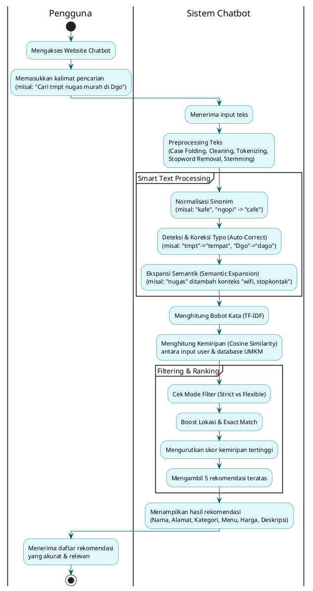

# 🍽️ Chatbot Rekomendasi Kuliner UMKM Bandung


Aplikasi chatbot cerdas berbasis AI untuk membantu Anda menemukan rekomendasi kuliner UMKM terbaik di Bandung. Menggunakan kombinasi **TF-IDF**, **Cosine Similarity**, dan **Advanced Ranking Mechanics** untuk memberikan hasil yang akurat dan relevan.

## ✨ Fitur Unggulan

### 1. 🧠 Search Engine Cerdas
Sistem pencarian tidak hanya mencocokkan kata kunci, tetapi memahami konteks:
- **Phrase Match Boost:** Memprioritaskan restoran yang memiliki menu persis dengan query Anda (misal: "Nasi Goreng Pedas").
- **Content Relevance Coverage:** Semakin banyak kata kunci yang cocok (baik di Nama Restoran maupun Menu), semakin tinggi peringkatnya.
- **Auto-Correction:** Typo kecil? Tidak masalah. Sistem akan memperbaikinya otomatis (misal: "aym gprk" -> "ayam geprek").
- **Semantic Expansion:** Memahami sinonim (misal: cari "Murah" akan mencakup "Terjangkau", "Hemat").

### 2. ⚠️ Intelligent Warning System
Sistem secara proaktif memberi tahu jika hasil pencarian terbatas untuk preferensi Anda:
- **Quality-Based Filter:** Hanya menghitung ketersediaan data dari restoran yang benar-benar relevan, mengabaikan hasil yang tidak cocok.
- **Smart Notification:** Jika Anda mencari "Ayam Geprek Murah" tapi datanya sedikit, sistem akan menyarankan untuk melihat opsi harga lain.

### 3. 🎨 User Interface Premium
- **Dark Mode Modern:** Tampilan visual yang elegan dan nyaman di mata.
- **Interactive Sidebar:** Filter harga dan kategori yang mudah diakses.
- **Responsive Design:** Tampilan tetap rapi di berbagai ukuran layar.

## 🔄 Alur Sistem Berjalan

Berikut adalah alur kerja sistem chatbot dari input pengguna hingga menampilkan rekomendasi:



### Penjelasan Tahapan:

1. **Input Pengguna**: User memasukkan query dalam bahasa natural (misal: "kopi murah di dago").

2. **Preprocessing**: Membersihkan teks dari noise (simbol, spasi ganda) dan mengubah kata ke bentuk dasar (stemming).

3. **Smart Processing**:
   - **Normalisasi Sinonim**: Menyatukan variasi kata (kafe/cafe/ngopi → cafe)
   - **Auto-Correct**: Memperbaiki typo otomatis
   - **Semantic Expansion**: Menambah konteks relevan (nugas → wifi, stopkontak)

4. **Calculation**: Menghitung kemiripan menggunakan TF-IDF dan Cosine Similarity.

5. **Ranking**: 
   - Menerapkan Strict/Flexible Mode berdasarkan kategori
   - Memberikan boost untuk lokasi yang sesuai (+15 poin)
   - Memberikan boost besar untuk exact match (+2000 poin)

6. **Output**: Menampilkan Top 5 rekomendasi dengan informasi lengkap dan link Google Maps.

## 🚀 Cara Menjalankan

### Prasyarat
- Python 3.8 atau lebih baru.
- Pip (Python Package Installer).

### Instalasi
1. Clone repository ini:
   ```bash
   git clone https://github.com/username/chatbot-kuliner.git
   cd chatbot-kuliner
   ```

2. Install dependencies:
   ```bash
   pip install -r requirements.txt
   ```

3. Jalankan aplikasi:
   ```bash
   streamlit run app.py
   ```

## 📂 Struktur Proyek

- `app.py`: Main application file (Frontend Streamlit).
- `chatbot_engine.py`: Core logic for search engine, ranking, and warning system.
- `preprocessing.py`: Text cleaning and preparation utilities.
- `dataset/`: Folder containing the culinary dataset (`data-kuliner-umkm-optimized.csv`).
- `style/`: CSS files for custom UI styling.
- `assets/`: Images and static resources.

## 🛠️ Teknologi

- **Backend:** Python, Pandas, Numpy, Scikit-learn.
- **Frontend:** Streamlit.
- **NLP:** Sastrawi (Stemming Bahasa Indonesia), RapidFuzz (Fuzzy Matching).

---
*Dibuat untuk mendukung UMKM Kuliner Bandung.*
